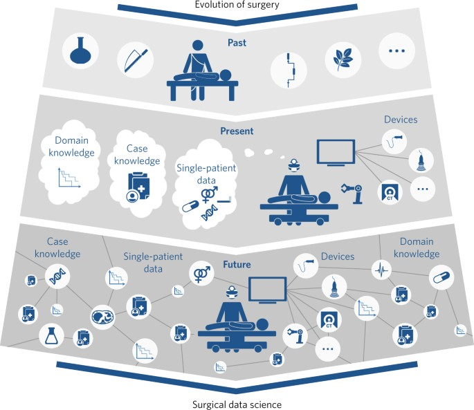

# Deep Learning for Surgical Data Science
Collated a list of useful open access work related to surgical phase recognition.

- Surgical phase recognition

- LSTM and RNN

- Transformers and Attention based Mechanism

- Others

# Surgical phase recognition

## 2021

## 2020

## 2019

## - 2019

# LSTM and RNN

## 2021

## 2020

## 2019

## - 2019

# _Transformers

## 2021

## 2020

## 2019

## - 2019

## _Others

## 2021

## 2020

## 2019

## - 2019

