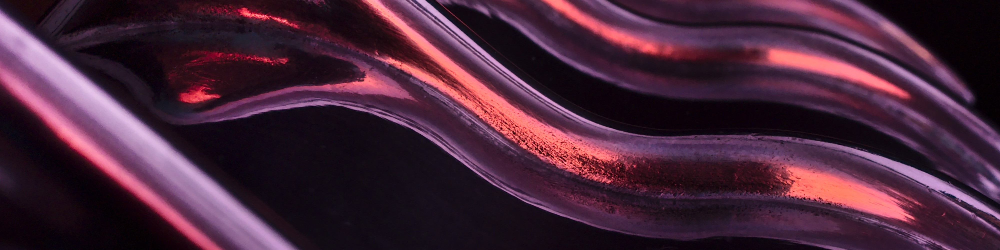

# AI for Surgery
Collated a list of useful open access work related to surgical phase recognition.

The following collection of content is divided into 6 parts:

- _Surgical Artificial Intelligence_

- _Surgical phase recognition_

- _LSTM, RNN and VAE_

- _Transformers and Attention based mechanism_

- _Self-Supervised Learning_

- _Other Links_

# Surgical Artificial Intelligence

[Papers review](docs/review-surgical-ai.md)

## 2021

- Gesture Recognition in Robotic Surgery: A Review, UCL, <https://ieeexplore.ieee.org/stamp/stamp.jsp?arnumber=9336292>

- Cross-modal self-supervised representation learning for gesture and skill recognition in robotic surgery, MICCAI2021, <https://link.springer.com/article/10.1007/s11548-021-02343-y>

- What is Artificial Intelligence Surgery?, <https://aisjournal.net/article/view/3890>

- IRCAD online course - Artificial intelligence (AI) and surgery, <https://websurg.com/en/doi/oc01en6290a/>

## 2020

- Surgical Data Science -- from Concepts to Clinical Translation, <https://arxiv.org/abs/2011.02284>

## 2019

- Artificial Intelligence in Surgery: Promises and Perils, <https://www.ncbi.nlm.nih.gov/pmc/articles/PMC5995666/>

## - 2019

- Surgical data science for next-generation interventions, 2017, <https://www.researchgate.net/profile/Germain-Forestier/publication/319651707_Surgical_data_science_for_next-generation_interventions/links/5f6df6d092851c14bc94c81a/Surgical-data-science-for-next-generation-interventions.pdf>

- Surgical data science: the new knowledge domain, 2017, <https://www.degruyter.com/document/doi/10.1515/iss-2017-0004/html>

# Surgical phase recognition

[Papers review](docs/review-surgical-phase-recognition.md)

## 2021

- OperA: Attention-Regularized Transformers for Surgical Phase Recognition, MICCAI 2021, <https://arxiv.org/abs/2103.03873>

- Aggregating Long-Term Context for Learning Laparoscopic and Robot-Assisted Surgical Workflows, <https://arxiv.org/abs/2009.00681>

- Against spatial–temporal discrepancy: contrastive learning-based network for surgical workflow recognition, IPCAI 2021, <https://link.springer.com/article/10.1007%2Fs11548-021-02382-5>

- Multi-Task Temporal Convolutional Networks for Joint Recognition of Surgical Phases and Steps in Gastric Bypass Procedures, IPCAI 2021, <https://arxiv.org/abs/2102.12218>

- SUrgical PRediction GAN for Events Anticipation, <https://arxiv.org/abs/2105.04642>

- Machine Learning for Surgical Phase Recognition
A Systematic Review, <https://journals.lww.com/annalsofsurgery/Fulltext/2021/04000/Machine_Learning_for_Surgical_Phase_Recognition__A.11.aspx>

## 2020

- Real-time automatic surgical phase recognition in laparoscopic sigmoidectomy using the convolutional neural network-based deep learning approach, <https://link.springer.com/article/10.1007%2Fs00464-019-07281-0>

- TeCNO: Surgical Phase Recognition with Multi-Stage Temporal Convolutional Networks, MICCAI 2020, <https://arxiv.org/abs/2003.10751>

- Assisted phase and step annotation for surgical videos, <https://www.researchgate.net/publication/339158015_Assisted_phase_and_step_annotation_for_surgical_videos>

- Impact of data on generalization of AI for surgical intelligence applications, <https://arxiv.org/abs/1806.00466>

- Aggregating Long-Term Context for Learning Laparoscopic and Robot-Assisted Surgical Workflows, <https://arxiv.org/abs/2009.00681>

- Towards Understanding Surgical Scenes Using Computer Vision - Bay Vision Virtual Meetup, <https://www.youtube.com/watch?v=twy5ZG2VA_g>

## 2019

- MS-TCN: Multi-stage temporal convolutional network for action segmentation, CVPR 2019, <https://arxiv.org/abs/1903.01945>

- Learning from a tiny dataset of manual annotations: a teacher/student approach for surgical phase recognition, IPCAI 2019, <https://arxiv.org/abs/1812.00033>

- Multi-Task Recurrent Convolutional Network with Correlation Loss for Surgical Video Analysis, <https://arxiv.org/abs/1907.06099>

- Using 3D Convolutional Neural Networks to Learn Spatiotemporal Features for Automatic Surgical Gesture Recognition in Video, MICCAI 2019, <https://arxiv.org/abs/1907.11454>

- Automated Surgical Activity Recognition with One Labeled Sequence, MICCAI 2019, https://arxiv.org/abs/1907.08825

- Weakly Supervised Convolutional LSTM Approach for Tool Tracking in Laparoscopic Videos, <https://arxiv.org/abs/1812.01366>

- Real-Time Extraction of Important Surgical Phases in Cataract Surgery Videos, <https://www.nature.com/articles/s41598-019-53091-8>

## - 2018

- SV-RCNet: Workflow Recognition From Surgical Videos Using Recurrent Convolutional Network, <https://ieeexplore.ieee.org/document/8240734>

- “Deep-Onto” network for surgical workflow and context recognition, <https://link.springer.com/article/10.1007%2Fs11548-018-1882-8>

- Surgical Activity Recognition in Robot-Assisted Radical Prostatectomy using Deep Learning, MICCAI 2018, <https://arxiv.org/abs/1806.00466>

- Less is More: Surgical Phase Recognition with Less Annotations through Self-Supervised Pre-training of CNN-LSTM Networks, 2018, <https://arxiv.org/abs/1805.08569>

- DeepPhase: Surgical Phase Recognition in CATARACTS Videos, MICCAI 2018, <https://arxiv.org/abs/1807.10565>

- Tool and Phase recognition using contextual CNN features, 2016, <https://arxiv.org/abs/1610.08854>

- EndoNet: A Deep Architecture for Recognition Tasks on Laparoscopic Videos, <https://arxiv.org/abs/1602.03012>

- Temporal Convolutional Networks: A Unified Approach to Action Segmentation, ECCV 2016, <https://arxiv.org/abs/1608.08242>

- LapOntoSPM: an ontology for laparoscopic surgeries and its application to surgical phase recognition, <https://link.springer.com/article/10.1007/s11548-015-1222-1>

-  Surgical gesture classification from video and kinematic data, 2013, <https://www.sciencedirect.com/science/article/abs/pii/S1361841513000522?via%3Dihub>

# RNNs

[Papers review](docs/review-LSTM.md)

## 2021

- Transfer Learning of Deep Spatiotemporal Networks to Model Arbitrarily Long Videos of Seizures, <https://scholar.google.co.uk/citations?hl=en&user=Gc2eg3kAAAAJ&view_op=list_works&sortby=pubdate>

## 2020

- A bio-inspired bistable recurrent cell allows for long-lasting memory, <https://arxiv.org/abs/2006.05252>

- Dynamical Variational Autoencoders: A Comprehensive Review, <https://arxiv.org/abs/2008.12595>

## 2019

## - 2019

- Illustrated Guide to LSTM’s and GRU’s: A step by step explanation, 2018, <https://towardsdatascience.com/illustrated-guide-to-lstms-and-gru-s-a-step-by-step-explanation-44e9eb85bf21>

- Recurrent Neural Networks (RNN) and Long Short-Term Memory (LSTM), 2017, <https://www.youtube.com/watch?v=WCUNPb-5EYI>

- LONG SHORT-TERM MEMORY, 1997, <https://www.bioinf.jku.at/publications/older/2604.pdf>

# Transformers and Attention based mechanism

[Papers review](docs/review-transformers.md)

## 2021

- Learning Transferable Visual Models From Natural Language Supervision, OpenAI 2021 <https://arxiv.org/abs/2103.00020>

- Perceiver: General Perception with Iterative Attention, DeepMind, ICML 2021, <https://arxiv.org/abs/2103.03206>

- Early Convolutions Help Transformers See Better, FAIR, <https://arxiv.org/abs/2106.14881>

- Trans-SVNet: Accurate Phase Recognition from Surgical Videos via Hybrid Embedding Aggregation Transformer, <https://arxiv.org/abs/2103.09712>

- Video Transformer Network, Theator, <https://arxiv.org/abs/2102.00719>

- When Vision Transformers Outperform ResNets without Pretraining or Strong Data Augmentations, <https://arxiv.org/abs/2106.01548>

- DINO: Emerging Properties in Self-Supervised Vision Transformers, FAIR, <https://arxiv.org/abs/2104.14294>

## 2020

- ViT: An Image is Worth 16x16 Words: Transformers for Image Recognition at Scale, <https://arxiv.org/abs/2010.11929>

- End-to-End Object Detection with Transformers, <https://arxiv.org/abs/2005.12872>

## 2019

## - 2019

- BERT: Pre-training of Deep Bidirectional Transformers for Language Understanding, 2018, <https://arxiv.org/abs/1810.04805>

- Transformer: Attention Is All You Need, 2017, <https://arxiv.org/abs/1706.03762>

## Self-Supervised and Unsupervised Learning

## 2021

- SEER: Self-supervised Pretraining of Visual Features in the Wild, Goyal, Caron, Misra, <https://arxiv.org/abs/2103.01988>

- Barlow Twins: Self-Supervised Learning via Redundancy Reduction, Zbontar, LeCun, ICML 2021, <https://arxiv.org/abs/2103.03230>

## 2020

- SwAV: Unsupervised Learning of Visual Features by Contrasting Cluster Assignments, Caron, Misra, NIPS 2020, <https://arxiv.org/abs/2006.09882>

- Improved Baselines with Momentum Contrastive Learning, Chen, Fan, <https://arxiv.org/abs/2003.04297>

- SimCLR: A Simple Framework for Contrastive Learning, Chen, Hinton, ICML 2020, <https://arxiv.org/abs/2002.05709>

- MoCo: Momentum Contrast for Unsupervised Visual Representation Learning, CVPR 2020, <https://arxiv.org/abs/1911.05722>

[Papers review]()

## Other Links

## 2021

- MLP-Mixer: An all-MLP Architecture for Vision, <https://arxiv.org/abs/2105.01601>

- Involution: Inverting the Inherence of Convolution for Visual Recognition, <https://arxiv.org/abs/2103.06255>

## - 2020

# Concluding Remarks

