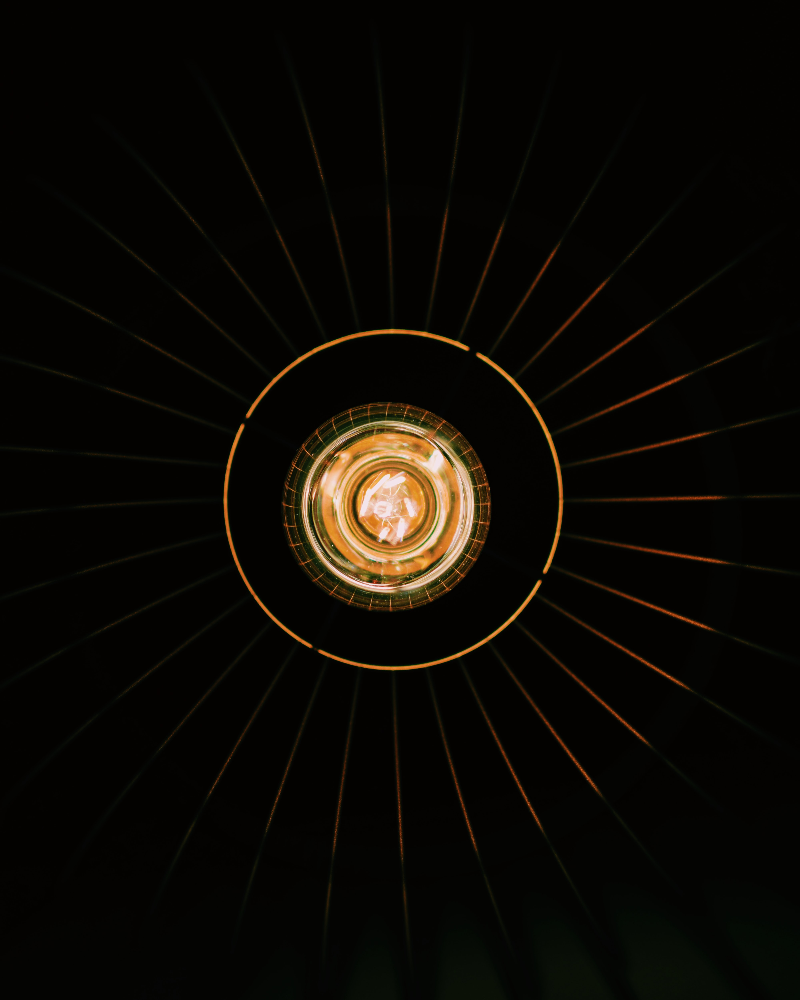

# AI for Surgical Data Science
Collated a list of useful open access work related to surgical phase recognition.

- _Surgical phase recognition_

- _LSTM and RNN_

- _Transformers and Attention based Mechanism_

- _Others_

# Surgical Data Science

## 2021

IRCAD online course - Artificial intelligence (AI) and surgery, <https://websurg.com/en/doi/oc01en6290a/>

## 2020

Surgical Data Science -- from Concepts to Clinical Translation
, <https://arxiv.org/abs/2011.02284>

## 2019

## - 2019

Surgical data science for next-generation interventions, 2017, <https://www.researchgate.net/profile/Germain-Forestier/publication/319651707_Surgical_data_science_for_next-generation_interventions/links/5f6df6d092851c14bc94c81a/Surgical-data-science-for-next-generation-interventions.pdf>

Surgical data science: the new knowledge domain, 2017, <https://www.degruyter.com/document/doi/10.1515/iss-2017-0004/html>

# Surgical phase recognition

## 2021

Machine Learning for Surgical Phase Recognition
A Systematic Review, <https://journals.lww.com/annalsofsurgery/Fulltext/2021/04000/Machine_Learning_for_Surgical_Phase_Recognition__A.11.aspx>

Video Transformer Network, <https://arxiv.org/abs/2102.00719>

## 2020

Assisted phase and step annotation for surgical videos, <https://www.researchgate.net/publication/339158015_Assisted_phase_and_step_annotation_for_surgical_videos>

Impact of data on generalization of AI for surgical intelligence applications, <https://arxiv.org/abs/1806.00466>

Towards Understanding Surgical Scenes Using Computer Vision - Bay Vision Virtual Meetup, <https://www.youtube.com/watch?v=twy5ZG2VA_g>

## 2019

Real-Time Extraction of Important Surgical Phases in Cataract Surgery Videos, <https://www.nature.com/articles/s41598-019-53091-8>

## - 2019

Surgical Activity Recognition in Robot-Assisted Radical Prostatectomy using Deep Learning, MICCAI 2018, <https://arxiv.org/abs/1806.00466>

Less is More: Surgical Phase Recognition with Less Annotations through Self-Supervised Pre-training of CNN-LSTM Networks
, 2018, <https://arxiv.org/abs/1805.08569>

# LSTM, VAE and RNN

## 2021

## 2020

A bio-inspired bistable recurrent cell allows for long-lasting memory, <https://arxiv.org/abs/2006.05252>

Dynamical Variational Autoencoders: A Comprehensive Review, <https://arxiv.org/abs/2008.12595>

## 2019

## - 2019

Recurrent Neural Networks (RNN) and Long Short-Term Memory (LSTM), 2017, <https://www.youtube.com/watch?v=WCUNPb-5EYI>

Illustrated Guide to LSTM’s and GRU’s: A step by step explanation, 2018, <https://towardsdatascience.com/illustrated-guide-to-lstms-and-gru-s-a-step-by-step-explanation-44e9eb85bf21>

# Transformers

## 2021

## 2020

## 2019

## - 2019

## Others

## 2021

## 2020

## 2019

## - 2019

